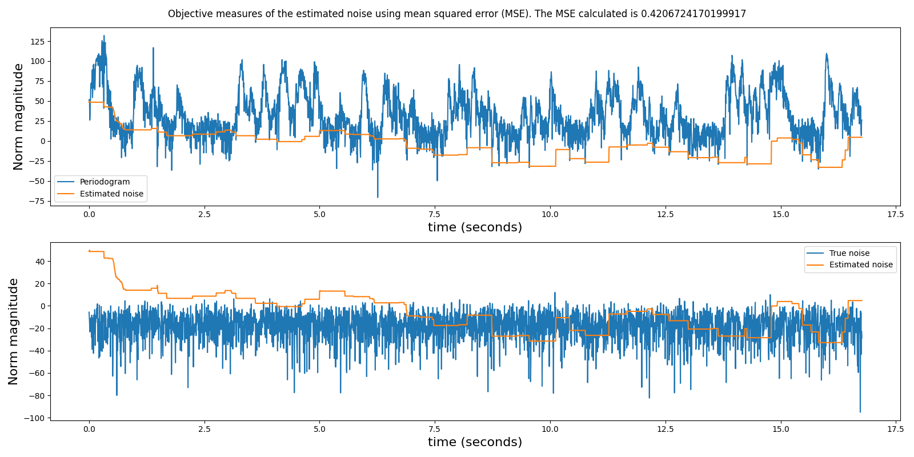

# spectral_estnoise_ms
Spectral noise estimation using minimum statistics project research was a proposed method for noise estimation in noisy speech signals which is used for the development of voice activity detectors (VADs). In this research, the implementation of the algorithm is developed in python 3 and tested for quality and code validation. Thereafter the nuanced version of the implementation is compared with existing noise estimation methods proposed by ITU for spectral occupancy measurement. The expectation of the development is that the nuanced version proposed by this research should outperform the existing methodologies and compensate their drawbacks.

## Results
A high-level overview of the sequence of steps or procedure taken towards the findings and results achieved in this research will be briefy discussed. To test the accuracy and validation of the implemented minimum statistics algorithm of Martin, a speech signal for the development and debugging process was recorded in a calm environment with a phone voice recorder application. It was 16.76 seconds long and it represented the clean speech signal, whereas the noisy speech signal was generated as an additive white gaussian noise at an SNR of 40dB to the clean speech signal according to the theory behind the proposed method. The spectrogram plots of the clean speech and the noisy speech are shown in Figures 1 and 2 respectively. They were produced at a 25 milliseconds short-time Fourier analysis using an overlap of 50%.

Figure 1

Figure 2 

First, the methodology achieved the implementation of the smoothing factor. Figure 3 shows the result of the smoothing parameter. To verify the accuracy of the results, we plotted the noisy speech signal alongside the results of the smoothed PSD vs PSD subplot (top subplot) and the smoothing factor (bottom subplot). As expected, at speech pauses, the smoothing factor attains values close to one and the smoothed PSD is smoother. Moreover, there are dips (where the smoothing factor approaches zero) when the speech is present and the smoothed PSD samples are less smooth.

Figure 3

With the first step solved, the next and final step is the computation of the unbiased estimate noise samples whose result is presented in Figure 4. It shows the subplots of the noise estimate on the noisy speech signal and the true noise versus the estimated noise.  The figure shows two subplots – the noise estimate versus the noisy speech signal and the true noise versus the estimated noise. The top plot shows that the estimated noise attains higher levels at the start compared to the end and based on the results of the bottom plot the estimation is closer to the true noise towards the end of the plot.

Figure 4

As stated in the paper publised by Martin, He performed experimental analysis using the percentage relative estimation error and the error variance between the noise estimate and the true noise for the different noise types he used. The mean squared error (MSE) is the mean of the error variance which is an acceptable metric for estimation analysis. The computed normalized MSE for the noisy speech signal using Martin’s algorithm was 0.4207. Same method of analysis was used for the shaded version we proposed and the results are presented in Figures 5 and 6. They show the plots of the smoothing factor and the noise estimation. With the proposed method, the MSE performance analysis gave a value of 0.2203 for the noisy speech signal.

Figure 5

Figure 6

Figures 7 and 8 show the spectrum plot of the signals across 6 MHz bandwidth and the corresponding comma-separated values (CSV) data. 

Figure 7

Figure 8

The result produced with the RF signal noise estimation were expected as with that of the noisy speech signal. The noise estimation in the RF signal tends towards the noise level in the spectrum plot and is unbiased towards the minimum. In comparison to other existing methods by ITU – the free channel and the 80% methods, the noise estimation is dynamic in time and frequency and shows close approximation to the 80% method than the free channel method which completely depends on the presence of a free channel during measurement. The result is presented in Figure 9 that shows the test spectrum band having 6 channels of equal bandwidth that are transmitting at equal power. The resemblance of the estimation gotten by the 80% method and the proposed method shows that the noise estimation accuracy has been maintained.

Figure 9

## Discussion
The results presented have shown the successful implementation of the noise estimation algorithm that uses minimum statistics and the improved noise estimation from the proposed method since the MSE is reduced from 0.4207 to 0.2203 which is approximately 50 percent. Also, the proposed noise estimation method closely correlates with the estimation using the 80 percent method however, it shows dynamism in time and frequency. Particularly in spectrum occupancy measurement that spans a large bandwidth the noise level shows appreciable changes with frequency, thus a noise estimation that tracks both changes in time and frequency has better accuracy with changing threshold values. 

## Bug fixes
The proposed changes addressed the computation of the smoothed PSD and the unbiased noise estimate. To tighten the estimation of the unbiased noise in the frequency domain, the smoothed PSD should not only smoothen the time domain but also the frequency domain. Hence, the equation below which smoothens the PSD of the noisy speech signal along the time domain (the time index n) was changed to smoothen in both the time and frequency domain. 
$$
P(n,k) = \alpha(n,k)P(n,k)+(1-\alpha(n,k)) |Y(n,k)|^2
$$
Prior to the changes, the equation computes the newest time vector of the smoothed PSD using the previous time vectors – smoothed PSD and the smoothing factor – this means it is recursive in time. To ensure the recursion is in both time and frequency, we made the recursion sweep through the previous time vector from each frequency component to the next while smoothing each PSD sample. Also, to acknowledge the unbiased noise estimate in the frequency domain, the same steps taken in noise estimation in the time domain were repeated in the frequency domain. However, the use of sub-window in the algorithm was not needed as the frequency index is usually a small value dependent on the user’s preference when analysing signals. Therefore, the length of the window used during the program would be used to track the minimum of the frequency samples. The pseudo code that shows the minimum statistics tracking in the frequency domain is given in Algorithm 1.

Algorithm 1
```python
For k in frequency_bins:
    if actmin(n,k)× noise_slope_max > min(P(n,k)×B_min (n,k)× B_c (n)):
        actmin(n,k) = min(P(n,k)×B_min (n,k)× B_c (n))
    noise_est(n,k) = actmin(n,k)
```
The result of the proposed method shows a bug with a different set of RF data as seen in Figure 10.

Figure 10

As seen, the estimation deviates from the noise level and tracks the signal towards the right.

## Code files
|Code files| Descripton|
|-----------|:-----------|
|`estnoise_ms.py`|External file from [@eesungkim](https://github.com/eesungkim/Voice_Activity_Detector) repo for vector/matrix operation|
|`ms_estnoise.py`|Martin's algorithm implementation|
|`ms_estnoise2.py`| Proposed algorithm|
|`spectral_estnoise_ms.py`|Main file for development and testing|
